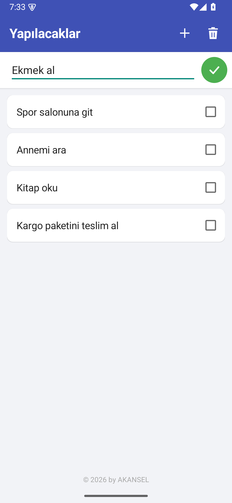
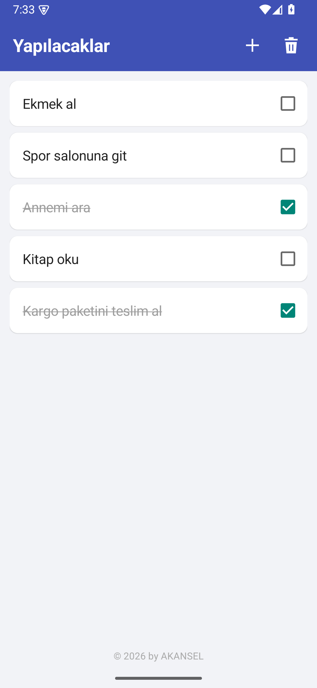
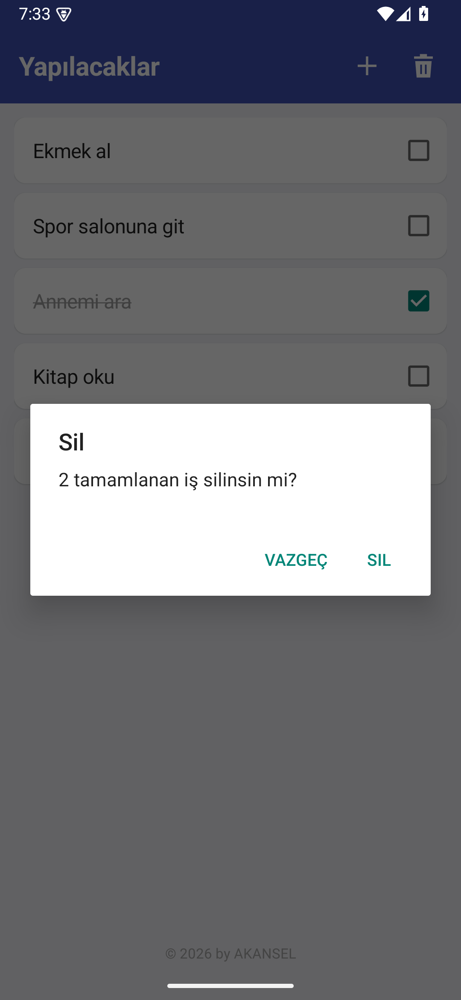

# Yapılacaklar

Android için sade ve hızlı bir yapılacaklar listesi uygulaması.

<p align="center">
  
  
  
  
</p>

## Özellikler

- **+** düğmesiyle yeni iş ekleme, **✓** ile kaydetme
- Tamamlanan işi yanındaki kutucukla işaretleme (üstü çizilir)
- **Çöp kutusu** ile tamamlanan işleri onaylayarak silme
- Liste telefonda saklanır, uygulama kapansa da kaybolmaz
- İnternet izni yok, hiçbir veri dışarı gönderilmez

## Kurulum

[Releases](../../releases) sayfasından `Yapilacaklar.apk` dosyasını indirip telefonda açın.
Gerekirse "bilinmeyen kaynaklardan yüklemeye izin ver" seçeneğini etkinleştirin.

Android 7.0 (API 24) ve üzeri gerekir.

## Derleme

Android SDK (build-tools 35, platform 35) ve JDK 17 yeterlidir, Gradle gerekmez:

```sh
export JAVA_HOME=/path/to/jdk-17
sh build.sh
```

Çıktı: `Yapilacaklar.apk`

## Lisans

© 2026 by AKANSEL. Tüm hakları saklıdır. Ayrıntılar için [LICENSE](LICENSE) dosyasına bakın.
